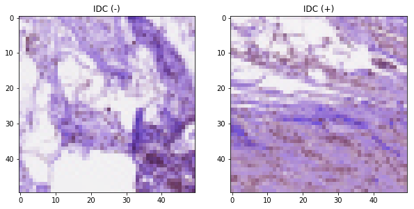

# IDC
Classification of the breast cancer subtype Invasive Ductal Carcinoma (IDC)

Data can be found here:
https://www.kaggle.com/paultimothymooney/breast-histopathology-images

Code is based on the implementation of Paul Mooney, which can be seen in the link above.

